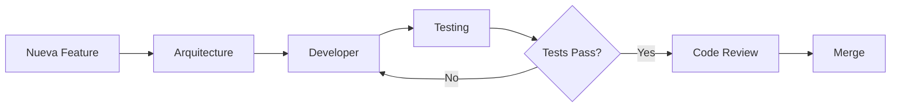

# Estructura de Agentes - Vegan Vita Backend

## 📁 Estructura de Carpetas

```
.claude/
├── README.md                  # Documentación principal de los agentes
├── ESTRUCTURA.md             # Este archivo (estructura visual)
├── settings.local.json       # Configuración local
└── agents/
    ├── arquitecture.md       # 🏛️ Agente de Arquitectura (12.9 KB)
    ├── developer.md          # 👨‍💻 Agente de Desarrollo (21.3 KB)
    └── testing.md            # 🧪 Agente de Testing (24.9 KB)

Total: ~59 KB de prompts profesionales
```

## 🎯 Propósito de Cada Archivo

### `.claude/README.md`
- 📖 Guía completa de uso de los agentes
- 🚀 Workflows recomendados
- 📝 Ejemplos prácticos
- 🐛 Troubleshooting
- ✅ Checklists

### `.claude/agents/arquitecture.md`
- 🏛️ **Agente de Arquitectura**
- **Tamaño:** 12.9 KB
- **Responsabilidad:** Diseño de sistemas, patrones, ADRs
- **Usa para:** Diseñar nuevas features, revisar arquitectura

### `.claude/agents/developer.md`
- 👨‍💻 **Agente de Desarrollo**
- **Tamaño:** 21.3 KB
- **Responsabilidad:** Implementación de código, refactoring
- **Usa para:** Escribir código, resolver bugs, implementar features

### `.claude/agents/testing.md`
- 🧪 **Agente de Testing**
- **Tamaño:** 24.9 KB
- **Responsabilidad:** Testing completo (unitarios, integración, E2E)
- **Usa para:** Crear tests, revisar cobertura, identificar edge cases

## 🔄 Flujo de Trabajo



## 🚀 Cómo Invocar

### Método 1: Solicitud Natural
```
"Invoca el agente de arquitectura para diseñar el sistema de órdenes"
```

### Método 2: Contexto Específico
```
"Usa el agente de desarrollo para implementar el OrdersModule
siguiendo el diseño del agente de arquitectura"
```

### Método 3: Encadenado
```
"Primero el agente de arquitectura diseña el sistema de pagos,
luego el agente de desarrollo lo implementa,
y finalmente el agente de testing crea la suite de tests"
```

## 📊 Características de los Agentes

| Agente | Tamaño | Secciones | Ejemplos | Checklists |
|--------|--------|-----------|----------|------------|
| **Arquitecture** | 12.9 KB | 9 | 5+ | 3 |
| **Developer** | 21.3 KB | 10 | 10+ | 2 |
| **Testing** | 24.9 KB | 8 | 15+ | 2 |

## 🎓 Nivel de Detalle

### Arquitecture
- ✅ Metodología de 4 fases
- ✅ SOLID Principles
- ✅ Clean Architecture
- ✅ Patrones de diseño
- ✅ ADRs (Architecture Decision Records)
- ✅ Diagramas Mermaid

### Developer
- ✅ Convenciones del proyecto
- ✅ Patrones establecidos (TypeORM, DTOs, Services)
- ✅ Manejo de errores
- ✅ Transacciones
- ✅ Seguridad
- ✅ Performance

### Testing
- ✅ Pirámide de testing (70-20-10)
- ✅ Tests unitarios (Jest)
- ✅ Tests de integración
- ✅ Tests E2E (Supertest)
- ✅ AAA Pattern
- ✅ Cobertura 80%+

## 📝 Contenido de Cada Agente

### arquitecture.md

```markdown
# Secciones:
1. Contexto del Proyecto
2. Metodología de Trabajo (4 fases)
3. Principios Arquitectónicos
4. Patrones y Prácticas
5. Decisiones Arquitectónicas (ADRs)
6. Estructura de Módulos
7. Checklist de Calidad
8. Anti-patterns a Evitar
9. Formato de Output
```

### developer.md

```markdown
# Secciones:
1. Contexto del Proyecto
2. Metodología de Desarrollo
3. Convenciones del Proyecto
   - Estructura de archivos
   - Naming conventions
   - Imports order
4. Patrones Establecidos
   - Entidades TypeORM
   - DTOs con class-validator
   - Services
   - Controllers
   - Modules
5. Manejo de Errores
6. Transacciones
7. Seguridad
8. Performance
9. Testing
10. Documentación
```

### testing.md

```markdown
# Secciones:
1. Contexto del Proyecto
2. Metodología de Testing
3. Pirámide de Testing
4. Estrategia de Cobertura
5. Convenciones de Tests
6. Tipos de Tests
   - Unitarios (70%)
   - Integración (20%)
   - E2E (10%)
7. Casos Edge
8. Comandos Útiles
9. Checklist de Testing
10. Formato de Output
```

## 🔧 Personalización

### Para Modificar un Agente

1. Abre el archivo correspondiente:
   ```bash
   code .claude/agents/arquitecture.md
   ```

2. Edita el contenido según necesites

3. Guarda y los cambios se aplican inmediatamente

### Para Agregar un Nuevo Agente

1. Crea un nuevo archivo en `.claude/agents/`:
   ```bash
   touch .claude/agents/nuevo-agente.md
   ```

2. Usa la misma estructura que los existentes

3. Actualiza este README

## 📚 Documentación Relacionada

- [README Principal del Proyecto](../README.md)
- [Análisis Completo del Proyecto](../ANALISIS_COMPLETO_PROYECTO.md)
- [Guía de Agentes Mejorados](../AGENTES_MEJORADOS.md)

## ✨ Características Especiales

### Contexto del Proyecto Integrado

Cada agente tiene **conocimiento específico del proyecto**:

- ✅ Stack: NestJS + TypeORM + PostgreSQL
- ✅ Estado: 40% completado
- ✅ Módulos existentes: Auth, Products, Categories, Reviews
- ✅ Por implementar: Orders, Payments, Admin Panel
- ✅ Convenciones: UUID, class-validator, JWT

### Prompts Profesionales

Basados en mejores prácticas de:
- Clean Code (Robert C. Martin)
- Software Architecture (Martin Fowler)
- The Art of Unit Testing (Roy Osherove)
- Domain-Driven Design (Eric Evans)

### Ejemplos del Mundo Real

Cada agente incluye ejemplos específicos del proyecto:
- Sistema de órdenes
- Integración de pagos PayPal
- Gestión de stock con transacciones
- Autenticación y autorización

## 🎯 Próximos Pasos

1. ✅ Lee [.claude/README.md](.claude/README.md)
2. ✅ Prueba cada agente con una tarea pequeña
3. ✅ Implementa el sistema de órdenes usando los 3 agentes
4. ✅ Ajusta los prompts según tu experiencia
5. ✅ Comparte feedback para mejorar

---

**Creado:** 01 de noviembre de 2025
**Versión:** 1.0
**Ubicación:** `.claude/ESTRUCTURA.md`
