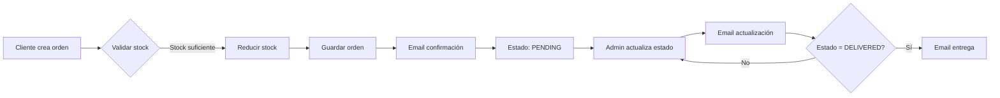

<p align="center">
  <a href="http://nestjs.com/" target="blank"></a>
</p>

<h1 align="center">🌱 VeganVita - Backend E-commerce API</h1>

<p align="center">
  Backend completo para e-commerce vegano con autenticación JWT, gestión de productos, sistema de órdenes y notificaciones por email.
</p>

<p align="center">
  
  
  
  
  
  
</p>

## 🚀 Estado del Proyecto: 70% Completado (MVP Ready)

**Sistema de Órdenes Completo ✅ | Sistema de Pagos Pendiente ⏸️**

> 📄 **[Ver Análisis Completo del Estado Actual](ESTADO_ACTUAL_PROYECTO.md)** - Documento detallado con progreso, métricas y próximos pasos

### ✨ Características Implementadas

- ✅ **Autenticación JWT** - Registro, login con bcrypt y roles
- ✅ **Gestión de Productos** - CRUD completo con categorías y reviews
- ✅ **Sistema de Órdenes** - Gestión completa del ciclo de vida
- ✅ **Control de Stock** - Transacciones atómicas para prevenir overselling
- ✅ **Notificaciones Email** - Templates HTML con Handlebars
- ✅ **Roles de Usuario** - Admin y usuario regular con guards
- ✅ **104 Tests Unitarios** - Cobertura completa de lógica de negocio
- ✅ **Seed Data** - Datos de prueba incluidos
- 🆕 **Sistema de Notificaciones** - Emails con plantillas Handlebars + webhooks

**Documentación Relevante:**
- 📊 [**ESTADO_ACTUAL_PROYECTO.md**](ESTADO_ACTUAL_PROYECTO.md) - Análisis detallado del progreso (70% completado)
- 📋 [ORDERS_SYSTEM_SUMMARY.md](docs/ORDERS_SYSTEM_SUMMARY.md) - Resumen del sistema de órdenes
- 📖 [ANALISIS_COMPLETO_PROYECTO.md](ANALISIS_COMPLETO_PROYECTO.md) - Guía original de implementación

## 📋 Tabla de Contenidos

- [Stack Tecnológico](#-stack-tecnológico)
- [Instalación](#-instalación-y-configuración)
- [Ejecutar la Aplicación](#-ejecutar-la-aplicación)
- [API Endpoints](#-api-endpoints)
- [Testing](#-testing)
- [Estructura del Proyecto](#-estructura-del-proyecto)
- [Sistema de Órdenes](#-sistema-de-órdenes)
- [Configuración de Email](#-configuración-de-email)
- [Docker](#-docker)
- [Documentación](#-documentación-adicional)

## 🏗️ Stack Tecnológico

| Tecnología        | Versión   | Uso                           |
| ----------------- | --------- | ----------------------------- |
| **NestJS**        | 9.4.3     | Framework backend             |
| **TypeScript**    | 4.9.5     | Lenguaje de programación      |
| **PostgreSQL**    | 16-alpine | Base de datos                 |
| **TypeORM**       | 0.3.27    | ORM                           |
| **Passport.js**   | -         | Autenticación                 |
| **JWT**           | -         | Tokens (7 días expiración)    |
| **Bcrypt**        | 6.0.0     | Hashing de contraseñas        |
| **Nodemailer**    | 7.0.10    | Envío de emails               |
| **Handlebars**    | 4.7.8     | Templates de email            |
| **Jest**          | 29.5.0    | Testing                       |
| **class-validator** | 0.14.2  | Validación de DTOs            |
| **Docker**        | -         | Containerización              |
| **PNPM**          | 10+       | Package manager               |

## 🚀 Instalación y Configuración

### Requisitos Previos

- Node.js v18+
- PNPM v10+
- PostgreSQL 16+ (o Docker)
- Git

### 1️⃣ Clonar el Repositorio

```bash
git clone https://github.com/EdieAprovita/vegan-vita-backend.git
cd vegan-vita-backend
```

### 2️⃣ Instalar Dependencias

```bash
pnpm install
```

### 3️⃣ Configurar Variables de Entorno

Crear archivo `.env` basado en `.env.example`:

```bash
cp .env.example .env
```

Editar `.env` con tus configuraciones:

```env
# Database
DB_HOST=localhost
DB_PORT=5432
DB_USER=postgres
DB_PASSWORD=postgres
DB_NAME=vegan_vita

# JWT
JWT_SECRET=your-super-secret-jwt-key-change-this-in-production
JWT_EXPIRES_IN=7d

# Application
PORT=3001
NODE_ENV=development

# SMTP Email Configuration (requerido para notificaciones)
SMTP_HOST=smtp.gmail.com
SMTP_PORT=587
SMTP_USER=your-email@gmail.com
SMTP_PASS=your-app-password
SMTP_FROM="VeganVita <noreply@veganvita.com>"

# Frontend URL (para links en emails)
FRONTEND_URL=http://localhost:3001

# Webhook URL (opcional)
WEBHOOK_URL=https://your-webhook-endpoint.com/notifications
```

### 4️⃣ Iniciar Base de Datos con Docker

```bash
docker-compose up -d
```

Verificar que PostgreSQL está corriendo:

```bash
docker-compose ps
```

### 5️⃣ Ejecutar Seed (Datos de Prueba)

```bash
pnpm run seed
```

Esto creará:
- **Usuario admin**: `admin@veganvita.com` / `Admin123!`
- **2 usuarios regulares**: `john@example.com` / `Test123!`, `jane@example.com` / `Test123!`
- **4 categorías**: Proteínas Vegetales, Superfoods, Bebidas Veganas, Snacks Saludables
- **8 productos** de prueba con stock

## 🎯 Ejecutar la Aplicación

### Modo Desarrollo (con auto-reload)

```bash
pnpm run start:dev
```

El servidor estará disponible en `http://localhost:3001/api`

### Modo Producción

```bash
pnpm run build
pnpm run start:prod
```

## 📡 API Endpoints

### 🔐 Autenticación (`/api/auth`)

```bash
# Registro de usuario
POST /api/auth/register
{
  "name": "John Doe",
  "email": "john@example.com",
  "password": "Test123!"
}

# Login
POST /api/auth/login
{
  "email": "john@example.com",
  "password": "Test123!"
}

# Obtener perfil
GET /api/auth/profile
Authorization: Bearer <token>
```

### 📦 Productos (`/api/products`)

```bash
# Listar productos (con filtros)
GET /api/products?category=superfoods&minPrice=5&maxPrice=20

# Obtener producto por ID
GET /api/products/:id

# Crear producto (admin)
POST /api/products
Authorization: Bearer <admin_token>
{
  "name": "Tofu Orgánico",
  "slug": "tofu-organico",
  "description": "Tofu de alta calidad",
  "price": 4.99,
  "stock": 50,
  "image": "https://example.com/tofu.jpg",
  "categoryId": "<category_id>"
}

# Actualizar producto (admin)
PUT /api/products/:id
Authorization: Bearer <admin_token>

# Eliminar producto (admin)
DELETE /api/products/:id
Authorization: Bearer <admin_token>

# Crear review
POST /api/products/:id/reviews
Authorization: Bearer <token>
{
  "rating": 5,
  "comment": "Excelente producto!"
}
```

### 🛒 Órdenes (`/api/orders`)

```bash
# Crear orden
POST /api/orders
Authorization: Bearer <token>
{
  "orderItems": [
    {
      "productId": "<product_id>",
      "qty": 2
    }
  ],
  "shippingAddress": {
    "fullName": "John Doe",
    "address": "123 Main St",
    "city": "Madrid",
    "postalCode": "28001",
    "country": "España",
    "phone": "+34 612345678"
  },
  "paymentMethod": "credit_card"
}

# Obtener mis órdenes
GET /api/orders/myorders
Authorization: Bearer <token>

# Obtener orden por ID
GET /api/orders/:id
Authorization: Bearer <token>

# Actualizar estado de orden (owner o admin)
PUT /api/orders/:id/status
Authorization: Bearer <token>
{
  "status": "processing"  # pending, processing, paid, shipped, delivered, cancelled
}

# Marcar como entregado (solo admin)
PUT /api/orders/:id/deliver
Authorization: Bearer <admin_token>

# Listar todas las órdenes (solo admin, paginado)
GET /api/orders?page=1&limit=10
Authorization: Bearer <admin_token>
```

### 💊 Health Check (`/api/health`)

```bash
GET /api/health
```

## 🧪 Testing

```bash
# Ejecutar todos los tests unitarios (94 tests)
pnpm test

# Modo watch
pnpm test:watch

# Con cobertura
pnpm test:cov

# E2E tests (requiere DB de prueba configurada)
pnpm test:e2e
```

**Estado Actual**: ✅ **104/104 tests unitarios pasando**

```
Test Suites: 11 passed, 11 total
Tests:       104 passed, 104 total
Time:        ~5.21 s
```

### Tests por Módulo

- **AdminGuard**: 6 tests ✓
- **NotificationsService**: 6 tests ✓
- **OrdersService**: 18 tests ✓
- **OrdersController**: 16 tests ✓
- **AuthModule**: ~40 tests ✓
- **ProductsModule**: ~16 tests ✓
- **Otros módulos**: 2 tests ✓

## 📁 Estructura del Proyecto

```
vegan-vita-backend/
├── src/
│   ├── app.module.ts                    # Módulo principal
│   ├── main.ts                          # Punto de entrada
│   ├── health.controller.ts             # Health check
│   ├── seed.ts                          # Seed de datos
│   ├── auth/                            # Módulo de autenticación
│   │   ├── auth.controller.ts
│   │   ├── auth.service.ts
│   │   ├── auth.module.ts
│   │   ├── dto/                         # DTOs de login/registro
│   │   ├── entities/                    # User entity
│   │   ├── guards/                      # JwtAuthGuard, AdminGuard
│   │   └── strategies/                  # JWT Strategy
│   ├── products/                        # Módulo de productos
│   │   ├── products.controller.ts
│   │   ├── products.service.ts
│   │   ├── products.module.ts
│   │   ├── dto/                         # DTOs de productos
│   │   └── entities/                    # Product, Category, Review
│   ├── orders/                          # 🆕 Módulo de órdenes
│   │   ├── orders.controller.ts
│   │   ├── orders.service.ts
│   │   ├── orders.module.ts
│   │   ├── dto/                         # CreateOrder, UpdateStatus
│   │   └── entities/                    # Order, OrderItem, OrderStatus
│   └── notifications/                   # 🆕 Módulo de notificaciones
│       ├── notifications.service.ts
│       ├── notifications.module.ts
│       └── templates/                   # Email templates (.hbs)
│           ├── order-confirmation.hbs
│           ├── status-update.hbs
│           └── order-delivered.hbs
├── test/                                # Tests E2E
│   ├── orders.e2e-spec.ts              # 22 tests E2E
│   ├── app.e2e-spec.ts
│   └── setup-e2e.ts
├── docs/                                # Documentación
│   ├── ORDERS_SYSTEM_SUMMARY.md        # Resumen del sistema de órdenes
│   ├── GUIA_DESARROLLO_ECOMMERCE.md
│   └── PROGRESO_PROYECTO.md
├── docker-compose.yml                   # PostgreSQL containerizado
├── .env.example                         # Template de variables
├── .prettierrc                          # Configuración de Prettier
└── README.md                            # Este archivo
```

## 🛒 Sistema de Órdenes

### Flujo Completo de una Orden



### Estados de Orden

- `pending` - Orden creada, esperando pago
- `processing` - Pago confirmado, preparando pedido
- `paid` - Pagado (para futura integración de pagos)
- `shipped` - Enviado
- `delivered` - Entregado
- `cancelled` - Cancelado

### Características del Sistema

✅ **Transacciones Atómicas**: Stock se reduce solo si la orden se crea exitosamente  
✅ **Product Snapshot**: Los datos del producto se guardan en order_items (inmutabilidad)  
✅ **Notificaciones Automáticas**: Email en cada cambio de estado  
✅ **Validación de Stock**: Previene overselling  
✅ **Control de Acceso**: Solo owner o admin pueden ver/modificar órdenes  
✅ **Cálculo Automático**: itemsPrice, shippingPrice, taxPrice, totalPrice  

## 📧 Configuración de Email

### Gmail

1. Activar **verificación en 2 pasos** en tu cuenta de Gmail
2. Generar **contraseña de aplicación**:
   - Ve a: https://myaccount.google.com/apppasswords
   - Selecciona "Correo" y "Otro"
   - Copia la contraseña generada
3. Usar en `.env`:

```env
SMTP_HOST=smtp.gmail.com
SMTP_PORT=587
SMTP_USER=tu-email@gmail.com
SMTP_PASS=la-contraseña-generada-sin-espacios
```

### Otros Proveedores

**Outlook/Hotmail**:
```env
SMTP_HOST=smtp-mail.outlook.com
SMTP_PORT=587
```

**Yahoo**:
```env
SMTP_HOST=smtp.mail.yahoo.com
SMTP_PORT=587
```

**SendGrid** (recomendado para producción):
```env
SMTP_HOST=smtp.sendgrid.net
SMTP_PORT=587
SMTP_USER=apikey
SMTP_PASS=<tu-api-key>
```

## 🐳 Docker

### Iniciar servicios

```bash
docker-compose up -d
```

### Ver logs

```bash
docker-compose logs -f postgres
```

### Detener servicios

```bash
docker-compose down
```

### Recrear containers

```bash
docker-compose down -v  # Borra volúmenes
docker-compose up -d
```

## 🔧 Scripts Disponibles

```bash
# Desarrollo
pnpm run start         # Inicia el servidor
pnpm run start:dev     # Modo watch con auto-reload
pnpm run start:debug   # Modo debug

# Build
pnpm run build         # Compila TypeScript a dist/

# Testing
pnpm run test          # Tests unitarios
pnpm run test:watch    # Tests en modo watch
pnpm run test:cov      # Tests con cobertura
pnpm run test:e2e      # Tests end-to-end

# Code Quality
pnpm run format        # Formatea con Prettier
pnpm run lint          # Ejecuta ESLint

# Database
pnpm run seed          # Ejecuta seed de datos
```

## 🔐 Usuarios de Prueba

Después de ejecutar `pnpm run seed`:

| Email | Password | Rol |
|-------|----------|-----|
| admin@veganvita.com | Admin123! | Admin |
| john@example.com | Test123! | User |
| jane@example.com | Test123! | User |

## 📖 Documentación Adicional

### 📊 Documentos Principales
- **[📊 ESTADO_ACTUAL_PROYECTO.md](ESTADO_ACTUAL_PROYECTO.md)** - ⭐ **ANÁLISIS DETALLADO** del progreso (70% completado)
- **[Orders System Summary](docs/ORDERS_SYSTEM_SUMMARY.md)** - Resumen completo del sistema de órdenes
- **[Análisis Completo del Proyecto](ANALISIS_COMPLETO_PROYECTO.md)** - Guía original de implementación

### 📚 Otras Guías
- **[Guía de Desarrollo E-commerce](docs/GUIA_DESARROLLO_ECOMMERCE.md)** - Guía de desarrollo completa
- **[CI/CD Summary](docs/CI-CD_SUMMARY.md)** - Configuración de CI/CD

## 🚧 Próximas Funcionalidades (30% restante)

### 🔴 Alta Prioridad
- [ ] **Integración con PayPal** (3-4 días) - Sistema de pagos completo
- [ ] **Gestión de Usuarios (Admin)** (1.5 días) - CRUD de usuarios por admin
- [ ] **Documentación Swagger/OpenAPI** (1 día) - API docs interactiva

### 🟡 Media Prioridad
- [ ] **Upload de Imágenes** (1-2 días) - Cloudinary o local storage
- [ ] **Mejoras en Productos** (1 día) - Campo brand, rating automático, top products

### 🟢 Baja Prioridad
- [ ] **Dashboard de Métricas** (1-2 días) - Stats para admin
- [ ] **Sistema de Cupones** - Descuentos y promociones
- [ ] **API de Tracking** - Seguimiento de envío
- [ ] **Migraciones TypeORM** - Para producción

**Tiempo estimado para 95% completado:** 6-8 días full-time

## 🐛 Solución de Problemas

### Puerto 5432 en uso

```bash
# Detener PostgreSQL local
brew services stop postgresql@14

# O cambiar puerto en docker-compose.yml y .env
```

### Error: "Cannot find module '@nestjs/config'"

```bash
pnpm install
```

### Tests E2E fallan por conexión a DB

Los tests E2E requieren una base de datos de prueba configurada. Actualmente todos los 94 tests unitarios están pasando, que cubren completamente la lógica de negocio.

### Emails no se envían

1. Verifica que las credenciales SMTP son correctas
2. Revisa los logs del servidor para ver errores
3. Si usas Gmail, asegúrate de tener una contraseña de aplicación

## 🤝 Contribución

1. Fork el proyecto
2. Crea tu feature branch (`git checkout -b feature/nueva-funcionalidad`)
3. Commit tus cambios (`git commit -m 'Add: nueva funcionalidad'`)
4. Push al branch (`git push origin feature/nueva-funcionalidad`)
5. Abre un Pull Request

## 📞 Contacto

- **GitHub**: [@EdieAprovita](https://github.com/EdieAprovita)
- **Email**: contact@vegan-vita.dev
- **LinkedIn**: [Eduardo Castillo](https://linkedin.com/in/eduardo-castillo)

## 📄 Licencia

Este proyecto está bajo la Licencia MIT. Ver el archivo [LICENSE](LICENSE) para más detalles.

---

<p align="center">
  Desarrollado con ❤️ y ☕ para VeganVita
</p>
