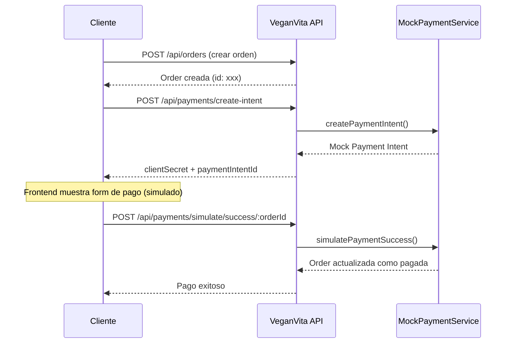
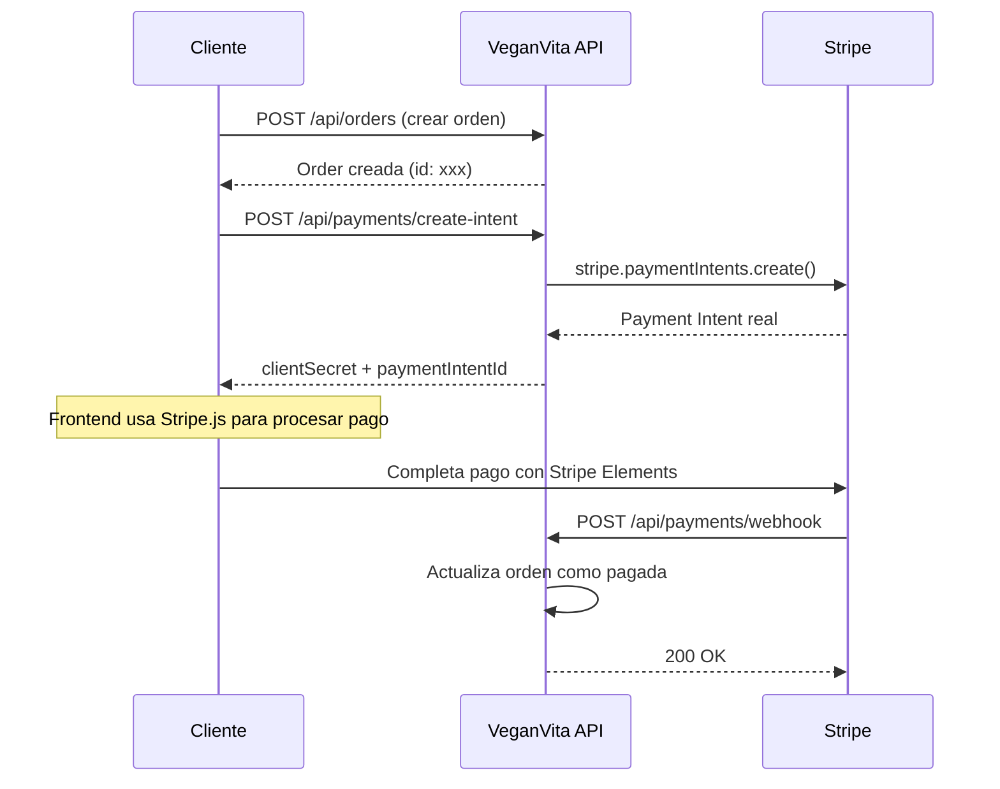

# Sistema de Pagos Dummy - Documentación

## Descripción

El sistema de pagos de VeganVita Backend soporta dos modos de operación:

- **`stripe`**: Modo producción con Stripe real (pagos reales)
- **`dummy`**: Modo desarrollo/testing con pagos simulados (sin cargos reales)

## Configuración

### Variable de Entorno

Añade la siguiente variable en tu archivo `.env`:

```bash
# Modo de pagos
# 'stripe' = Pagos reales con Stripe (producción)
# 'dummy' = Pagos simulados para desarrollo/testing
PAYMENTS_MODE=dummy
```

### Requisitos por Modo

#### Modo Dummy (`PAYMENTS_MODE=dummy`)

No requiere configuración de Stripe. Ideal para:

- Desarrollo local
- Testing
- Demos sin pagos reales
- CI/CD

#### Modo Stripe (`PAYMENTS_MODE=stripe`)

Requiere las siguientes variables adicionales:

```bash
STRIPE_SECRET_KEY=sk_test_xxxxxxxxxxxx
STRIPE_WEBHOOK_SECRET=whsec_xxxxxxxxxxxx
STRIPE_PUBLISHABLE_KEY=pk_test_xxxxxxxxxxxx  # Opcional
```

## Endpoints Disponibles

### Endpoints Comunes (Ambos Modos)

| Método | Endpoint                         | Descripción              | Auth |
| ------ | -------------------------------- | ------------------------ | ---- |
| `GET`  | `/api/payments/mode`             | Ver modo actual de pagos | No   |
| `POST` | `/api/payments/create-intent`    | Crear intención de pago  | JWT  |
| `GET`  | `/api/payments/:paymentIntentId` | Obtener estado del pago  | JWT  |
| `POST` | `/api/payments/webhook`          | Webhook de Stripe        | No   |

### Endpoints Solo Modo Dummy

| Método | Endpoint                                  | Descripción                | Auth  |
| ------ | ----------------------------------------- | -------------------------- | ----- |
| `POST` | `/api/payments/simulate/success/:orderId` | Simular pago exitoso       | JWT   |
| `POST` | `/api/payments/simulate/failure/:orderId` | Simular pago fallido       | JWT   |
| `POST` | `/api/payments/simulate/refund/:orderId`  | Simular reembolso          | JWT   |
| `GET`  | `/api/payments/simulate/intents`          | Ver todos los intents mock | Admin |
| `POST` | `/api/payments/simulate/clear`            | Limpiar todos los intents  | Admin |

## Ejemplos de Uso

### 1. Verificar Modo Actual

```bash
curl http://localhost:3000/api/payments/mode
```

**Respuesta (modo dummy):**

```json
{
  "mode": "dummy",
  "isDummy": true,
  "message": "⚠️ MODO DUMMY activo - Los pagos NO son reales"
}
```

### 2. Crear Payment Intent

```bash
curl -X POST http://localhost:3000/api/payments/create-intent \
  -H "Authorization: Bearer <token>" \
  -H "Content-Type: application/json" \
  -d '{"orderId": "uuid-de-la-orden"}'
```

**Respuesta:**

```json
{
  "clientSecret": "pi_mock_xxx_secret_xxx",
  "paymentIntentId": "pi_mock_xxx",
  "amount": 10000,
  "currency": "usd",
  "status": "requires_payment_method"
}
```

### 3. Simular Pago Exitoso (Solo Dummy)

```bash
curl -X POST http://localhost:3000/api/payments/simulate/success/uuid-de-la-orden \
  -H "Authorization: Bearer <token>"
```

**Respuesta:**

```json
{
  "success": true,
  "message": "[MOCK] Pago simulado exitosamente para orden uuid-de-la-orden",
  "order": {
    "id": "uuid-de-la-orden",
    "isPaid": true,
    "paidAt": "2025-12-14T15:30:00.000Z",
    "stripePaymentStatus": "succeeded"
  }
}
```

### 4. Simular Pago Fallido (Solo Dummy)

```bash
curl -X POST http://localhost:3000/api/payments/simulate/failure/uuid-de-la-orden \
  -H "Authorization: Bearer <token>" \
  -H "Content-Type: application/json" \
  -d '{"reason": "Tarjeta rechazada"}'
```

### 5. Simular Reembolso (Solo Dummy)

```bash
curl -X POST http://localhost:3000/api/payments/simulate/refund/uuid-de-la-orden \
  -H "Authorization: Bearer <token>"
```

## Flujo de Pago Completo

### Modo Dummy



### Modo Stripe (Producción)



## Tests

Los tests cubren:

- ✅ Creación de Payment Intents mock (20 tests)
- ✅ Simulación de pagos exitosos
- ✅ Simulación de pagos fallidos
- ✅ Simulación de reembolsos
- ✅ Validaciones de permisos
- ✅ Edge cases (orden ya pagada, cancelada, etc.)

```bash
# Ejecutar tests del sistema de pagos
pnpm test payments

# Resultado esperado
Test Suites: 3 passed, 3 total
Tests:       30+ passed, 30+ total
```

## Cambiar a Producción

Para activar pagos reales:

1. Obtener claves de Stripe (producción o test):
   - https://dashboard.stripe.com/apikeys

2. Actualizar `.env`:

   ```bash
   PAYMENTS_MODE=stripe
   STRIPE_SECRET_KEY=sk_live_xxxxxxxxxxxx
   STRIPE_WEBHOOK_SECRET=whsec_xxxxxxxxxxxx
   ```

3. Configurar webhook en Stripe Dashboard:
   - URL: `https://tu-dominio.com/api/payments/webhook`
   - Eventos:
     - `payment_intent.succeeded`
     - `payment_intent.payment_failed`
     - `payment_intent.canceled`
     - `charge.refunded`

4. Reiniciar la aplicación

## Notas Importantes

⚠️ **El modo dummy NO debe usarse en producción** - Los pagos no son reales.

⚠️ **Los payment intents mock se almacenan en memoria** - Se pierden al reiniciar la app.

⚠️ **Los endpoints de simulación están bloqueados en modo Stripe** - Retornan error 400.

## Archivos Relacionados

- [payments.module.ts](src/payments/payments.module.ts) - Configuración del módulo
- [payments.service.ts](src/payments/payments.service.ts) - Servicio Stripe real
- [payments-mock.service.ts](src/payments/payments-mock.service.ts) - Servicio mock
- [payments.controller.ts](src/payments/payments.controller.ts) - Endpoints
- [env.validation.ts](src/config/env.validation.ts) - Validación de variables
